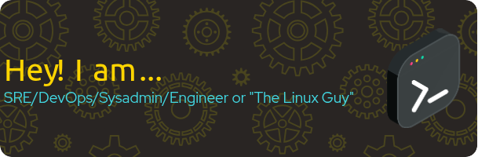

<!-- Title -->
<h1 align="center" title="...and I'm happy to see you here :)">👋 𝙷𝚎𝚕𝚕𝚘! 𝙸'𝚖 Esli</h1>

<p align="center"> 
<a href="https://esli.blog.br" target="_blank">
  
</a> 
  
</p>

<!-- Contact and keys -->
<p align="center">
<!-- <a href="mailto:   " title="Email Address"><code>  </code></a> │ --><a href="https://keys.openpgp.org/vks/v1/by-fingerprint/6DDA9E4841D4B1F1E43A64775EF74834A3C9651A" title="PGP Public Key"><code>5EF7 4834 A3C9 651A</code></a> | <a href="https://keybase.io/esl1h/pgp_keys.asc?fingerprint=aeb30f179f402d37522586e584cb48faad1264d2" title="keybase"><code>(at)keybase.io</code></a> │ <a href="https://matrix.to/#/@esli:matrix.org" title="Matrix User ID"><code>@esli:matrix.org</code></a>
</p>


<!-- Socials -->
<p align="center">
   <kbd>
<a href="https://stackshare.io/Esl1h" target="_blank"></a> 
<a href="https://x.com/esl1h" target="_blank"></a> 
<a href="https://www.linkedin.com/in/eslih" target="_blank"></a> 
<a href="https://stackoverflow.com/users/4122311/esli-silva" target="_blank"></a> 
<a href="https://youtube.com/@eslih" target="_blank"></a> 
<a href="https://medium.com/@esl1h" target="_blank"></a> 
<a href="https://steamcommunity.com/id/esl1h" target="_blank"></a> 
<a href="https://anchor.fm/esl1h" target="_blank"></a> 
<a href="https://esli.blog.br/" target="_blank"></a> 
  </kbd>
</p>


<p align="center">

</br>
<a href="https://stackexchange.com/users/4974728/esli-silva" target=”_blank”></a>

</p>
<br/>
  
<!-- Outer collapsible -->  
<details>
   <summary><b>↕️ Expand for more!</b></summary>
  
   <br>
   
<!-- About Section -->
<details>
  <summary><b>👤 About</b></summary>
    <p>
      
- 🔭 I’m currently working on **financial systems and FinTechs in Brazil**

- 🧑‍💼 Formerly Zenvia, PagSeguro, Serasa Experian, Nubank...

- 🌱 I’m currently learning **AI, LLM and some languages (V, Rust, ...)**

- 👯 I’m looking to collaborate on **FOSS projects**

- 📝 I regularly write articles on [esli.blog.br](esli.blog.br)

- 💬 Ask me about **Linux, Network, Privacy**

- 📫 How to reach me **not.announced@simplelogin.fr**

- 📄 Know about my experiences [https://www.linkedin.com/in/eslih/?locale=en_US](https://www.linkedin.com/in/eslih/?locale=en_US)

- ⚡ Trivia facts: **Bass player, KravMaga, Brazilian-born with EU-Portuguese citizenship**

    
----
  
  </p>
</details>


<!-- About github-profile-trophy 
<details>
  <summary><b>👤 github-profile-trophy</b></summary>
    <p>

<p align="left"> <a href="https://github.com/ryo-ma/github-profile-trophy"></a> </p>


<p align="center"> 
  <a href="https://github.com/ryo-ma/github-profile-trophy">
</a> 
  
[](https://github.com/ryo-ma/github-profile-trophy)

</br>

    
----
  </p>
</details> -->


<!-- About articles -->
<details>
  <summary><b>📚 Some Articles</b></summary>
    <p>


| SRE | Artigos em Inglês | Inteligência Artificial |
|-----|-------------------|------------------------|
| [Simplicidade no SRE](https://esli.blog.br/simplicidade-no-sre) | [RTFM: Read The F\*cking Manual](https://esli.blog.br/rtfm-read-the-fcking-manual) | [Inteligência Artificial - Parte 1: Evolução, principais empresas e seu futuro](https://esli.blog.br/inteligencia-artificial-parte-1-evolucao-principais-empresas-e-seu-futuro) |
| [As documentações do SRE](https://esli.blog.br/as-documentacoes-do-sre) | [Unlocking the Power of AI, LLMs and Prompts for SREs, Sysadmins and DevOps](https://esli.blog.br/unlocking-the-power-of-ai-llms-and-prompts-for-sres-sysadmins-and-devops) | [Inteligência Artificial - Parte 2: Entenda AI generativa, redes neurais, LLMs e tokens](https://esli.blog.br/inteligencia-artificial-parte-2-entenda-ai-generativa-redes-neurais-llms-e-tokens) |
| [As monitorações do SRE](https://esli.blog.br/as-monitoracoes-do-sre) |   | [Desbloqueando o poder da AI, LLM e Prompts para SREs, Sysadmins e DevOps](https://esli.blog.br/desbloqueando-o-poder-da-ai-llm-e-prompts-para-sres-sysadmins-e-devops) |
| [Melhores práticas para SRE](https://esli.blog.br/melhores-praticas-para-sre) |   |   |
| [Docs as Code: Documentação como Código](https://esli.blog.br/docs-as-code-documentacao-como-codigo) |   |   |
| [DocOps](https://esli.blog.br/docops) |   |   |
| [SRE Product Manager](https://esli.blog.br/sre-product-manager) |   |   |
    
----
  </p>
</details>

<!-- About github stats
<details>
  <summary><b>Github Stats</b></summary>
    <p>


</p>
    
----
  </p>
</details>  -->

<details>
  <summary><b>🔐 PGP</b></summary>
    <p>
      
```Public Key
-----BEGIN PGP PUBLIC KEY BLOCK-----
Comment: Type:	EdDSA de 255 bits
Comment: fingerprint:	6DDA 9E48 41D4 B1F1 E43A  6477 5EF7 4834 A3C9 651A

mDMEaHpsWRYJKwYBBAHaRw8BAQdAHfBFDttJjXjg+3yBzzxR1X25+MrNxX9tU4Uo
kL892ZO0FUVzbGkgPGVzbGlAbXVyZW5hLmlvPoiTBBMWCgA7AhsDBQsJCAcCAiIC
BhUKCQgLAgQWAgMBAh4HAheAFiEEbdqeSEHUsfHkOmR3XvdINKPJZRoFAmh6bHAA
CgkQXvdINKPJZRroKAEA7C/vUVrCI/VeL+PmUav/9qVH8NA15MO2psfzdKH1uREB
ALfB2hODWh5NMTyTnJho08+L0T87GFcSIwaiUSa0HOoOuDgEaHpsWRIKKwYBBAGX
VQEFAQEHQJgJ3s82fxpi9h+EkOMtl1TF8z8kNLueCyPFaqg/h5lhAwEIB4h4BBgW
CgAgAhsMFiEEbdqeSEHUsfHkOmR3XvdINKPJZRoFAmh6bHQACgkQXvdINKPJZRr/
ywEAklF2ZzvZsz1PmZ/5PBfWO/dfebdzeZ4VETb2CxRUCyAA/2ZhCuNxsMUYw1lb
7oBIT5MkLcRfvIerhCjkeIooORkB
=p+6h
-----END PGP PUBLIC KEY BLOCK-----
```

</p>
    
----
  </p>
</details>

</details>


<br>
<br/>

<!-- HASHNODE:START -->

<!-- HASHNODE:END -->

  <a href="https://github.com/Esl1h/Esl1h"></a> 
  <a href="https://github.com/Esl1h/Esl1h"></a>

 <a href="https://git.io/streak-stats"></a>

</p>
