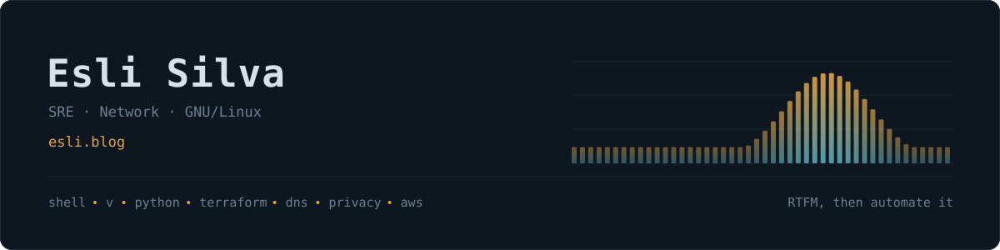
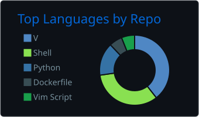
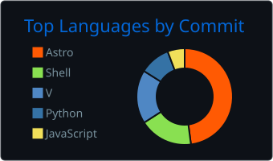
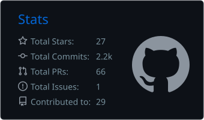
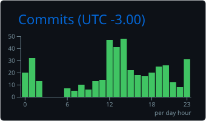

<picture>
  <source media="(prefers-color-scheme: dark)" srcset="./assets/hero-dark.svg">
  <source media="(prefers-color-scheme: light)" srcset="./assets/hero-light.svg">
  
</picture>

SRE and infrastructure engineer working with financial systems and fintechs in Brazil.
I build small, auditable tools in **Shell**, **V** and **Python**, mostly around DNS,
Linux hardening, backups, secrets and self-hosting. I write about it (pt-BR and EN)
at **[esli.blog](https://esli.blog)**.

<p align="center">
<a href="https://esli.blog" title="esli.blog"></a><a href="https://stackoverflow.com/users/4122311/esli-silva" title="Stack Overflow"></a><a href="https://stackexchange.com/users/4974728/esli-silva" title="Stack Exchange"></a><a href="https://www.linkedin.com/in/eslih/?locale=en_US" title="LinkedIn"></a><a href="https://x.com/esl1h" title="X"></a><a href="https://youtube.com/@eslih" title="YouTube"></a><a href="https://matrix.to/#/@esli:matrix.org" title="Matrix"></a><a href="https://keys.openpgp.org/vks/v1/by-fingerprint/6DDA9E4841D4B1F1E43A64775EF74834A3C9651A" title="PGP public key"></a><a href="https://esli.blog/posts/git/" title="GitLab, Codeberg, Radicle"></a>
</p>

---

## Projects

**Infrastructure & SRE**

| Project | Stack | What it does |
|---|---|---|
| [DNSbench](https://github.com/Esl1h/DNSbench) | V | Ranks DNS resolvers from your own connection, including CDN edge quality |
| [terraform-exchanger](https://github.com/Esl1h/terraform-exchanger) | Shell | Reuses the same Terraform code across multiple environments |
| [gist-sync](https://github.com/Esl1h/gist-sync) | Shell | Mirrors GitHub Gists to GitLab, Codeberg, Gitea, Keybase and Radicle |
| [sysz-ng](https://github.com/Esl1h/sysz-ng) | Shell | `fzf` terminal UI for `systemctl` |
| [ai-md-stack](https://github.com/Esl1h/ai-md-stack) | Shell | One canonical `AGENTS.md` shared across coding agents, with enforcement hooks |

**Privacy & security**

| Project | Stack | What it does |
|---|---|---|
| [yubikey-shell-toolkit](https://github.com/Esl1h/yubikey-shell-toolkit) | Shell | YubiKey management, encryption and validation from the terminal |
| [vBackups](https://github.com/Esl1h/vBackups) | V | Encrypted and signed backups with integrity verification |
| [Brave-Filters-and-Scriptlets](https://github.com/Esl1h/Brave-Filters-and-Scriptlets) | JS | Custom adblock filters and scriptlets for Brave |
| [proton-launcher-extension](https://github.com/Esl1h/proton-launcher-extension) | JS | Opens Proton services as web apps on Chromium browsers |

**Linux workstation**

| Project | Stack | What it does |
|---|---|---|
| [UAI-FAI](https://github.com/Esl1h/UAI-FAI) | Shell | Post-install provisioning for Ubuntu and Fedora |
| [dotfiles](https://github.com/Esl1h/dotfiles) | - | Arch/Hyprland and Fedora/KDE configs |
| [easy1090](https://github.com/Esl1h/easy1090) | Shell | One-command ADS-B stack on Arch: RTL-SDR driver, `readsb` and feeders |
| [linux-daw-ssl-lowlatency](https://github.com/Esl1h/linux-daw-ssl-lowlatency) | Shell | Exclusive ALSA access for DAWs under PipeWire, at the lowest latency |

**Apps & experiments**

| Project | Stack | What it does |
|---|---|---|
| [climabr.app](https://github.com/Esl1h/climabr.app) | Astro | Brazilian weather and environmental dashboard |
| [tokenmeter](https://github.com/Esl1h/tokenmeter) | Python | Pi Zero 2 W + e-ink display showing LLM token quota and usage |
| [humanize-br](https://github.com/Esl1h/humanize-br) | Python | Rewrites AI-sounding text into natural pt-BR |

---

## Snippets

Thirty-something [gists](https://gist.github.com/Esl1h) of things I got tired of rewriting:

| Snippet | Use |
|---|---|
| [SRE system prompt](https://gist.github.com/Esl1h/5188c37cf6136bf6cb009b94bec11912) (`pt`/`en`) | LLM system prompt for SRE, DevOps and sysadmin work |
| [CMDB with Steampipe + Powerpipe](https://gist.github.com/Esl1h/62cd37ce260a199ae3dd811c07cefc68) | Cloud inventory as a queryable CMDB, with a systemd unit |
| [`sysctl.conf` hardening](https://gist.github.com/Esl1h/65c0d67780ee6212ebce00efe76d6007) | Kernel hardening and tuning, tested on Debian, CentOS and Arch |
| [gitflow-analyzer](https://gist.github.com/Esl1h/505eca9fa78bd0ff11d2ffa8dc60e5da) | Audits branch structure, PR history and CI/CD pipelines |
| [git-multi-sync](https://gist.github.com/Esl1h/c129f30397478bc255e0190856b08cd2) | Adds, creates and syncs the same repo across multiple remotes |
| [Orphan AWS load balancers](https://gist.github.com/Esl1h/ebab9460f9f8f1a127708ffc79ece7a4) | Finds LBs with no healthy targets attached |
| [Parse YAML in Bash](https://gist.github.com/Esl1h/ae6aa5262c19b4e3774d29868b76dd18) | No `yq`, no Python, just `sed` and stubbornness |

---

## Writing

Long-form at [esli.blog](https://esli.blog), mostly Portuguese, some pieces in both
languages. Most of it is written as a series, so each one has an entry point.

| Series | Parts | Start here |
|---|---|---|
| **YubiKey** | 6 | [2FA, from obligation to architecture](https://esli.blog/posts/yubikey-introducao/) |
| **SDR & ADS-B** | 8 | [SDR: radio on Linux](https://esli.blog/posts/sdr-radio-no-linux/) |
| **Encrypted DNS** | 4 | [DNSCrypt, DNS Stamps and encrypted DNS](https://esli.blog/posts/dnscrypt-dns-stamps-e-dns-criptografado-o-guia-que-faltava/) |
| **File encryption with age** | 4 | [age: simple, modern file encryption](https://esli.blog/posts/age-criptografia-de-arquivos-simples-moderna-e-segura/) |
| **SRE practice** | 12+ | [Best practices for SRE](https://esli.blog/posts/melhores-praticas-para-sre/) |
| **AI for SRE** | 7 | [Why I use Claude for SRE work](https://esli.blog/posts/ai-para-sre-por-que-usar-o-claude/) |
| **V for sysadmins** | 5 | [From Bash to V](https://esli.blog/posts/de-bash-para-v-um-guia-pratico-para-sysadmins-sres-devops/) |
| **Linux audio & DAWs** | 6 | [Bass on Linux with the SSL 2+ MkII](https://esli.blog/posts/contrabaixo-no-linux/) |

<details>
<summary><b>YubiKey: full series</b></summary>

1. [Introdução ao 2FA](https://esli.blog/posts/yubikey-introducao/)
2. [Instalação no Linux](https://esli.blog/posts/yubikey-linux-instalacao/)
3. [2FA no console, ssh e sudo](https://esli.blog/posts/yubikey-console-sudo-ssh/)
4. [OpenSSH com ed25519-sk / ecdsa-sk](https://esli.blog/posts/yubikey-ssh-ed25519-ecdsa/)
5. [Chaves GPG](https://esli.blog/posts/yubikey-chaves-gpg/)
6. [Compilado: criptografia, Linux e o que mudou](https://esli.blog/posts/yubikey-compilado-com-criptografia-linux-e-o-que-mudou-de-l-para-c/)

Also: [YubiKey na programação: guia para SRE, DevOps e Sysadmin](https://esli.blog/posts/yubikey-na-programa-o-guia-completo-para-sre-devops-e-sysadmin/)
· in English, [The Ultimate YubiKey Guide and Setup for Linux](https://esli.blog/posts/the-ultimate-yubikey-guide-and-setup-for-linux/)

</details>

<details>
<summary><b>SDR & ADS-B: full series</b></summary>

1. [SDR: rádio no Linux](https://esli.blog/posts/sdr-radio-no-linux/)
2. [ADS-B, SDR e a comunicação](https://esli.blog/posts/adsb-sdr-radio-no-linux/)
3. [RTL-SDR v4 no Linux](https://esli.blog/posts/rtl-sdr-v4/)
4. [Capturando ADS-B em 1090 MHz](https://esli.blog/posts/rtl-sdr-v4-adsb-1090/)
5. [Do terminal ao mapa: tar1090](https://esli.blog/posts/rtl-sdr-v4-tar1090/)
6. [Todas as formas de ver o ADS-B em tempo real](https://esli.blog/posts/guia-visualizacao-adsb/)
7. [ADSBExchange: enviando os dados](https://esli.blog/posts/adsbexchange-feed/)
8. [easy1090: instalador completo](https://esli.blog/posts/easy1090/)

In English: [ADS-B on Arch Linux, and the installer it took](https://esli.blog/posts/adsb-on-arch-linux/)

</details>

<details>
<summary><b>Encrypted DNS & privacy</b></summary>

- [DNSCrypt, DNS Stamps e DNS criptografado](https://esli.blog/posts/dnscrypt-dns-stamps-e-dns-criptografado-o-guia-que-faltava/)
- [dnscrypt-proxy no Linux](https://esli.blog/posts/dnscrypt-proxy-no-linux-configurando-dns-criptografado/)
- [DNS criptografado no Android](https://esli.blog/posts/dns-criptografado-no-android-invizible-pro-e-alternativas/)
- [SNI leak: o calcanhar de Aquiles do DNS seguro](https://esli.blog/posts/sni-leak-o-calcanhar-de-aquiles-do-dns-seguro/)
- [Teste seu navegador contra vazamentos e fingerprint](https://esli.blog/posts/teste-seu-navegador-contra-vazamentos/)
- [Vigilância governamental: Five Eyes, MLAT e outros](https://esli.blog/posts/vigilancia-governamental/)
- [NTS: autenticando a hora do seu Linux](https://esli.blog/posts/nts-por-que-voc-precisa-autenticar-a-hora-do-seu-linux/)

In English: [Encrypted DNS: The Guide](https://esli.blog/posts/encrypted-dns-the-guide-dnscrypt-dns-stamps-linux-setup-android-and-the-sni-problem/)

</details>

<details>
<summary><b>Encryption & age</b></summary>

- [Ferramentas para criptografia](https://esli.blog/posts/ferramentas-para-criptografia/)
- [Como escolher ferramentas de criptografia](https://esli.blog/posts/como-escolher-ferramentas-de-criptografia/)
- [age: criptografia de arquivos simples e moderna](https://esli.blog/posts/age-criptografia-de-arquivos-simples-moderna-e-segura/)
- [age + YubiKey](https://esli.blog/posts/age-yubikey/)

In English: [Beyond GPG: Hardware-Backed File Encryption with age and YubiKey](https://esli.blog/posts/beyond-gpg-hardware-backed-file-encryption-with-age-and-yubikey/)

</details>

<details>
<summary><b>SRE practice</b></summary>

- [Melhores práticas para SRE](https://esli.blog/posts/melhores-praticas-para-sre/)
- [SRE e métricas](https://esli.blog/posts/sre-e-metricas/) · [DORA, 4 Golden Signals e os Mean Times](https://esli.blog/posts/metricas-para-sres-devops-e-afins/)
- [Gerenciamento de crises e incidentes](https://esli.blog/posts/sre-e-o-gerenciamento-de-crises-e-incidentes/) · [boas práticas](https://esli.blog/posts/sre-e-as-boas-praticas-para-gestao-de-incidentes/) · [o Incident Commander](https://esli.blog/posts/sre-e-o-incident-commander/)
- [SRE num ambiente tradicional de TI](https://esli.blog/posts/sre-em-ambiente-tradicional-de-ti/) · [e a sustentação das operações](https://esli.blog/posts/sre-e-a-sustentacao-das-operacoes/)
- [Engenharia de resiliência em sistemas distribuídos](https://esli.blog/posts/sre-e-a-engenharia-de-resiliencia-em-sistemas-distribuidos/)
- [Pare de fazer cosplay de Big Tech: o SRE do Google não é a bíblia](https://esli.blog/posts/pare-de-fazer-cosplay-de-bigtech/)
- [O ciclo de vida real da engenharia: sua POC não é produção](https://esli.blog/posts/o-ciclo-de-vida-real-da-engenharia/)
- [Team Topologies e a engenharia de plataforma](https://esli.blog/posts/team-topology-e-a-engenharia-de-plataforma/)
- [Simplicidade no SRE](https://esli.blog/posts/simplicidade-no-sre/) · [As documentações](https://esli.blog/posts/as-documentacoes-do-sre/) · [As monitorações](https://esli.blog/posts/as-monitoracoes-do-sre/)
- [Docs as Code](https://esli.blog/posts/docs-as-code-documentacao-como-codigo/) · [DocOps](https://esli.blog/posts/docops/) · [SRE Product Manager](https://esli.blog/posts/sre-product-manager/)

In English: [RTFM: Read The F\*cking Manual](https://esli.blog/posts/rtfm-read-the-fcking-manual/)

</details>

<details>
<summary><b>AI for SRE, and V</b></summary>

- [My AI setup: Claude, Abacus and OpenCode](https://esli.blog/posts/ai-setup-claude-opencode/)
- [AI para SRE: por que usar o Claude](https://esli.blog/posts/ai-para-sre-por-que-usar-o-claude/) · [Claude CLI: automação real para SRE](https://esli.blog/posts/claude-cli-automacao-real-para-sre/)
- [AI coding com agents locais e open source](https://esli.blog/posts/ai-coding-com-agents-locais-e-open-source/)
- [Seu repositório precisa falar "LLMês"](https://esli.blog/posts/desenvolvimento-com-ai/)
- [O lock-in das IDEs de IA](https://esli.blog/posts/ai-ides-forks-opensource/)
- [De Bash para V: guia prático para sysadmins, SREs e DevOps](https://esli.blog/posts/de-bash-para-v-um-guia-pratico-para-sysadmins-sres-devops/)
- [Introdução ao V](https://esli.blog/posts/introducao-a-linguagem-de-programacao-v-guia-completo/) · [web server em V](https://esli.blog/posts/construindo-um-simples-web-server-em-vlang/) · [tratamento de erros](https://esli.blog/posts/tecnicas-para-lidar-com-erros-em-vlang-utilizando-ossystem-e-operador-or/)

</details>

[All posts](https://esli.blog/posts/) · [RSS](https://esli.blog/rss.xml)

---

## Activity

<!-- Generated daily by GitHub Actions and committed to this repo. No third-party runtime. -->


<p>
  
  
</p>
<p>
  
  
</p>

<details>
<summary><b>Languages, habits and follow-up</b></summary>


</details>

---

## Stack

`Linux (Arch/Hyprland, Fedora/KDE)` `AWS` `Kubernetes / EKS` `Terraform` `OpenSearch`
`Prometheus` `Steampipe / Powerpipe` `Shell` `V` `Python` `Perl` `Rust`

<details>
<summary><b>Background</b></summary>

- Currently working on financial systems and fintechs in Brazil
- Previously Zenvia, PagSeguro, Serasa Experian, Nubank
- Learning V and Rust; using LLMs as day-to-day SRE tooling
- Open to collaborating on FOSS: infra, privacy and Linux tooling
- Brazilian-born, EU/Portuguese citizenship. Bass player, Krav Maga, IDSC LatAm

</details>

<details>
<summary><b>Keys</b></summary>

```
PGP    6DDA 9E48 41D4 B1F1 E43A  6477 5EF7 4834 A3C9 651A
age    age1yubikey1qfvyh29sgkgwj6fx3see6ea54zl9rfhrjz3a4hrejqtnwvclfktrygh6ecj
```

Private keys are hardware-bound to a YubiKey and non-exportable.
Full public keys: [keys.openpgp.org](https://keys.openpgp.org/vks/v1/by-fingerprint/6DDA9E4841D4B1F1E43A64775EF74834A3C9651A) · [keybase](https://keybase.io/esl1h/pgp_keys.asc?fingerprint=aeb30f179f402d37522586e584cb48faad1264d2)

</details>
